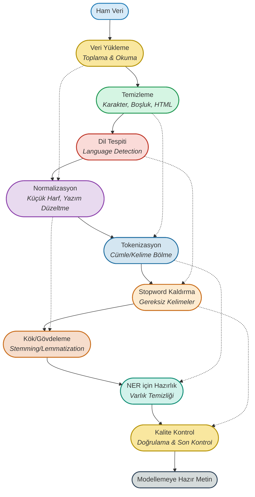

# 01. Metin Ön İşleme (Text Preprocessing)

<!-- SİSTEM MİMARİSİ & YOLCULUK -->
## 🚦 Metin Ön İşleme Yolculuğu

<p align="center">
  <b>Ham veriden temiz, anlamlı ve modellemeye hazır metne giden profesyonel yolculuk!</b>
</p>

<!-- Daha kare ve dengeli bir mermaid diyagramı -->


---

## 🌟 Metin Ön İşleme Aşamaları & Flashcardlar

### 1. **Veri Yükleme (Toplama & Okuma)**
- **Amaç:** Ham metin verisini elde etmek ve uygun formata getirmek.
- **Soru:** Veri yükleme neden kritik?  
  **Cevap:** Kaliteli ve doğru formatta veri, tüm sürecin temelidir.

---

### 2. **Temizleme (Cleaning)**
- **Aşamalar:**  
  - Özel karakter, sayı, HTML etiketi, gereksiz boşluk temizliği
- **Kod:**
  ```python
  import re
  metin = "<p>Merhaba NLP! 2024 yılında, Python ile çalışıyoruz...</p>"
  temiz = re.sub(r'<.*?>', '', metin)  # HTML etiketlerini kaldır
  temiz = re.sub(r'[^a-zA-ZçğıöşüÇĞİÖŞÜ\s]', '', temiz)  # özel karakterleri kaldır
  temiz = temiz.strip()
  print(temiz)
  # çıktı: Merhaba NLP yılında Python ile çalışıyoruz
  ```
- **Soru:** Temizleme neden gereklidir?  
  **Cevap:** Gürültüyü azaltır, modelin anlamlı veriyle çalışmasını sağlar.

---

### 3. **Dil Tespiti (Language Detection)**
- **Amaç:** Çok dilli veri setlerinde doğru dilde işlem yapmak.
- **Soru:** Dil tespiti neden kritik?  
  **Cevap:** Yanlış dilde yapılan işlemler model başarısını düşürür.

---

### 4. **Normalizasyon (Küçük Harf, Yazım Düzeltme)**
- **Aşamalar:**  
  - Tüm metni küçük harfe çevirme
  - Yazım hatalarını düzeltme, kısaltmaları açma
- **Kod:**
  ```python
  temiz = temiz.lower()
  # örnek yazım düzeltme için: pip install autocorrect
  from autocorrect import Speller
  spell = Speller(lang='tr')
  duzeltilmis = spell(temiz)
  print(duzeltilmis)
  # çıktı: merhaba nlp yılında python ile çalışıyoruz
  ```
- **Soru:** Normalizasyonun faydası nedir?  
  **Cevap:** Tutarlılık sağlar, farklı yazılmış aynı kelimeleri birleştirir.

---

### 5. **Tokenizasyon (Cümle/Kelime Bölme)**
- **Aşamalar:**  
  - Cümle ve kelime bazında bölme
- **Kod:**
  ```python
  from nltk.tokenize import word_tokenize
  tokenler = word_tokenize(duzeltilmis, language="turkish")
  print(tokenler)
  # çıktı: ['merhaba', 'nlp', 'yılında', 'python', 'ile', 'çalışıyoruz']
  ```
- **Soru:** Tokenizasyon nedir?  
  **Cevap:** Metni anlamlı parçalara ayırma işlemidir.

---

### 6. **Stopword Kaldırma**
- **Aşamalar:**  
  - "ve", "ile", "bu" gibi anlamsız kelimelerin çıkarılması
- **Kod:**
  ```python
  from nltk.corpus import stopwords
  stop_words = set(stopwords.words('turkish'))
  filtreli = [w for w in tokenler if w not in stop_words]
  print(filtreli)
  # çıktı: ['merhaba', 'nlp', 'yılında', 'python', 'çalışıyoruz']
  ```
- **Soru:** Metin ön işleme sürecinde stopword (gereksiz kelime) kaldırmanın model başarısına etkisi nedir ve neden gereklidir?  
  **Cevap:** Stopword kaldırma işlemi, metin içerisindeki "ve", "ile", "bu" gibi anlam taşımayan, cümle yapısı için gerekli fakat modelin öğrenmesi açısından katkı sağlamayan kelimeleri temizler. Bu sayede model, asıl anlamı taşıyan kelimelere odaklanır ve gereksiz bilgiyle uğraşmaz. Özellikle Türkçe gibi eklemeli dillerde, stopword'lerin çıkarılması modelin daha hızlı ve doğru öğrenmesini sağlar, eğitim süresini kısaltır ve sonuçların doğruluğunu artırır.

---

### 7. **Kök Bulma & Gövdeleme (Stemming & Lemmatization)**
- **Aşamalar:**  
  - Kelimeleri kök/gövde haline indirgeme
- **Kod:**
  ```python
  from nltk.stem.snowball import SnowballStemmer
  stemmer = SnowballStemmer("turkish")
  kokler = [stemmer.stem(k) for k in filtreli]
  print(kokler)
  # çıktı: ['merhab', 'nlp', 'yıl', 'python', 'çalış']
  ```
- **Soru:** Lemmatizasyon ile stemming farkı nedir?  
  **Cevap:** Lemmatizasyon, kelimenin sözlükteki kökünü bulur; stemming ise basitçe gövdeye indirger.

---

### 8. **NER için Hazırlık (Varlık Temizliği)**
- **Amaç:** Kişi, yer, organizasyon gibi varlıkların doğru tespiti için metni sadeleştirmek.
- **Soru:** NER öncesi ön işleme neden önemli?  
  **Cevap:** Gürültülü veri, NER doğruluğunu azaltır.

---

### 9. **Kalite Kontrol & Doğrulama**
- **Amaç:** Tüm adımlar sonrası verinin tutarlılığını kontrol etmek.
- **Soru:** Kalite kontrol neden kritik?  
  **Cevap:** Hatalı ön işleme, model başarısını düşürür.

---

## 🎯 En İyi Uygulamalar & İpuçları

- **Pipeline oluşturun:** Tüm adımları otomatikleştirin.
- **Dil bağımlılıklarını unutmayın:** Türkçe için özel karakter ve ekler kritik.
- **Veri kaybına dikkat:** Gereksiz bilgi silmeyin.
- **Her adımda kalite kontrolü yapın.**

---

## 📂 Klasör İçeriği

- `01.metin-on-isleme/temizleme.py` : Temel metin temizleme fonksiyonları
- `01.metin-on-isleme/tokenizasyon.py` : Tokenizasyon örnekleri
- `01.metin-on-isleme/stopword.py` : Stopword kaldırma uygulamaları
- `01.metin-on-isleme/kok_bulma.py` : Stemming ve lemmatization örnekleri
- `01.metin-on-isleme/ornek_veri/` : Örnek metin dosyaları

---

## 💡 Kaynaklar

- [NLTK Documentation](https://www.nltk.org/)
- [spaCy Documentation](https://spacy.io/)
- [Türkçe Doğal Dil İşleme Kaynakları](https://github.com/ahmetax/tr-nlp-tools)

---

> **Metin ön işleme, NLP projelerinin temelidir. Temiz veri, güçlü modellerin anahtarıdır!**