# 01. Metin Ön İşleme (Text Preprocessing)

## 🚦 Metin Ön İşleme Yolculuğu

```mermaid
flowchart TD
    style A1 fill:#D6EAF8,stroke:#2980B9,stroke-width:2px
    style B1 fill:#F9E79F,stroke:#B7950B,stroke-width:2px
    style B2 fill:#D5F5E3,stroke:#229954,stroke-width:2px
    style B3 fill:#FADBD8,stroke:#C0392B,stroke-width:2px
    style B4 fill:#E8DAEF,stroke:#8E44AD,stroke-width:2px
    style B5 fill:#D4E6F1,stroke:#2471A3,stroke-width:2px
    style B6 fill:#FDEBD0,stroke:#CA6F1E,stroke-width:2px
    style B7 fill:#F6DDCC,stroke:#CA6F1E,stroke-width:2px
    style B8 fill:#D1F2EB,stroke:#148F77,stroke-width:2px
    style B9 fill:#F9E79F,stroke:#B7950B,stroke-width:2px
    style Z1 fill:#D5DBDB,stroke:#34495E,stroke-width:2px

    A1([Ham Veri])
    B1([Veri Yükleme<br><i>Toplama & Okuma</i>])
    B2([Temizleme<br><i>Karakter, Boşluk, HTML</i>])
    B3([Dil Tespiti<br><i>Language Detection</i>])
    B4([Normalizasyon<br><i>Küçük Harf, Yazım Düzeltme</i>])
    B5([Tokenizasyon<br><i>Cümle/Kelime Bölme</i>])
    B6([Stopword Kaldırma<br><i>Gereksiz Kelimeler</i>])
    B7([Kök/Gövdeleme<br><i>Stemming/Lemmatization</i>])
    B8([NER için Hazırlık<br><i>Varlık Temizliği</i>])
    B9([Kalite Kontrol<br><i>Doğrulama & Son Kontrol</i>])
    Z1([Modellemeye Hazır Metin])

    A1 --> B1
    B1 --> B2
    B2 --> B3
    B3 --> B4
    B4 --> B5
    B5 --> B6
    B6 --> B7
    B7 --> B8
    B8 --> B9
    B9 --> Z1

    B1 -.-> B4
    B4 -.-> B7
    B2 -.-> B5
    B5 -.-> B8
    B3 -.-> B6
    B6 -.-> B9
```

<p align="center">
  <b>Ham YouTube yorumlarından temiz, anlamlı ve modellemeye hazır metne giden profesyonel yolculuk!</b>
</p>



---

## 📊 Proje Özeti

Bu klasörde, **MR Beast'in en çok izlenen YouTube videosuna ait 100.000+ yorum** üzerinde profesyonel metin ön işleme süreci adım adım uygulanmaktadır.  
Çalışmalar, gerçek sosyal medya verisiyle, endüstri standardı Python kütüphaneleri (pandas, nltk, spacy, vb.) ve modern veri bilimi teknikleriyle yapılmıştır.

### Ana Adımlar:
- Veri setinin yüklenmesi ve incelenmesi
- Eksik ve tekrarlı verilerin temizlenmesi
- Metinlerin küçük harfe dönüştürülmesi
- Noktalama ve özel karakter temizliği
- Stopword temizliği
- Lemmatizasyon ve stemming
- Sonuçların karşılaştırılması

---

## 🌟 Metin Ön İşleme Aşamaları & Flashcardlar

### 1. **Veri Yükleme (Toplama & Okuma)**
- **Amaç:** Ham YouTube yorumlarını uygun formata getirmek.
- <div style="border:1px solid #2980B9; border-radius:8px; padding:12px; background:#F4F8FB; margin:10px 0;">
  <b>Soru:</b> Veri yükleme neden kritik bir adımdır ve sürecin başarısına nasıl etki eder?<br>
  <b>Cevap:</b> Veri yükleme, projenin temelini oluşturur. Ham verinin doğru ve eksiksiz toplanması, sonraki tüm işlemlerin sağlıklı ilerlemesi için gereklidir.
  </div>

---

### 2. **Temizleme (Cleaning)**
- **Aşamalar:**  
  - Özel karakter, sayı, HTML etiketi, gereksiz boşluk temizliği
- **Kod:**
  ```python
  import re
  metin = "<p>Merhaba NLP! 2024 yılında, Python ile çalışıyoruz...</p>"
  temiz = re.sub(r'<.*?>', '', metin)  # HTML etiketlerini kaldır
  temiz = re.sub(r'[^a-zA-ZçğıöşüÇĞİÖŞÜ\s]', '', temiz)  # özel karakterleri kaldır
  temiz = temiz.strip()
  print(temiz)
  # çıktı: Merhaba NLP yılında Python ile çalışıyoruz
  ```
- <div style="border:1px solid #229954; border-radius:8px; padding:12px; background:#F4FBF4; margin:10px 0;">
  <b>Soru:</b> Temizleme adımı neden gereklidir ve model performansına nasıl katkı sağlar?<br>
  <b>Cevap:</b> Temizleme işlemi, metindeki gereksiz karakterleri ve gürültüyü ortadan kaldırarak verinin daha anlamlı ve işlenebilir hale gelmesini sağlar.
  </div>

---

### 3. **Dil Tespiti (Language Detection)**
- **Amaç:** Çok dilli veri setlerinde doğru dilde işlem yapmak.
- <div style="border:1px solid #C0392B; border-radius:8px; padding:12px; background:#FDF2F0; margin:10px 0;">
  <b>Soru:</b> Dil tespiti neden kritik bir adımdır ve yanlış dilde işlem yapılırsa ne gibi sorunlar ortaya çıkar?<br>
  <b>Cevap:</b> Yanlış dilde yapılan işlemler, anlam kaybına ve model başarısının ciddi şekilde düşmesine yol açar. Doğru dil tespiti, uygun ön işleme ve analiz için gereklidir.
  </div>

---

### 4. **Normalizasyon (Küçük Harf, Yazım Düzeltme)**
- **Aşamalar:**  
  - Tüm metni küçük harfe çevirme
  - Yazım hatalarını düzeltme, kısaltmaları açma
- **Kod:**
  ```python
  temiz = temiz.lower()
  # örnek yazım düzeltme için: pip install autocorrect
  from autocorrect import Speller
  spell = Speller(lang='tr')
  duzeltilmis = spell(temiz)
  print(duzeltilmis)
  # çıktı: merhaba nlp yılında python ile çalışıyoruz
  ```
- <div style="border:1px solid #8E44AD; border-radius:8px; padding:12px; background:#F7F1FA; margin:10px 0;">
  <b>Soru:</b> Normalizasyonun metin işleme sürecindeki rolü nedir ve neden gereklidir?<br>
  <b>Cevap:</b> Normalizasyon, aynı anlama gelen fakat farklı yazılmış kelimelerin tek bir biçimde temsil edilmesini sağlar. Modelin kelimeleri daha tutarlı işlemesine yardımcı olur.
  </div>

---

### 5. **Tokenizasyon (Cümle/Kelime Bölme)**
- **Aşamalar:**  
  - Cümle ve kelime bazında bölme
- **Kod:**
  ```python
  from nltk.tokenize import word_tokenize
  tokenler = word_tokenize(duzeltilmis, language="turkish")
  print(tokenler)
  # çıktı: ['merhaba', 'nlp', 'yılında', 'python', 'ile', 'çalışıyoruz']
  ```
- <div style="border:1px solid #2471A3; border-radius:8px; padding:12px; background:#F4F8FB; margin:10px 0;">
  <b>Soru:</b> Tokenizasyon nedir ve metin madenciliğinde neden önemli bir adımdır?<br>
  <b>Cevap:</b> Tokenizasyon, metni cümle veya kelime gibi daha küçük ve anlamlı parçalara ayırma işlemidir. Modelin kelimeleri analiz edebilmesi için gereklidir.
  </div>

---

### 6. **Stopword Kaldırma**
- **Aşamalar:**  
  - "ve", "ile", "bu" gibi anlamsız kelimelerin çıkarılması
- **Kod:**
  ```python
  from nltk.corpus import stopwords
  stop_words = set(stopwords.words('turkish'))
  filtreli = [w for w in tokenler if w not in stop_words]
  print(filtreli)
  # çıktı: ['merhaba', 'nlp', 'yılında', 'python', 'çalışıyoruz']
  ```
- <div style="border:1px solid #CA6F1E; border-radius:8px; padding:12px; background:#FDF6ED; margin:10px 0;">
  <b>Soru:</b> Stopword kaldırmanın model başarısına etkisi nedir ve neden gereklidir?<br>
  <b>Cevap:</b> Stopword'lerin çıkarılması, modelin asıl anlamı taşıyan kelimelere odaklanmasını sağlar ve gereksiz bilgiyle uğraşmasını engeller.
  </div>

---

### 7. **Kök Bulma & Gövdeleme (Stemming & Lemmatization)**
- **Aşamalar:**  
  - Kelimeleri kök/gövde haline indirgeme
- **Kod:**
  ```python
  from nltk.stem.snowball import SnowballStemmer
  stemmer = SnowballStemmer("turkish")
  kokler = [stemmer.stem(k) for k in filtreli]
  print(kokler)
  # çıktı: ['merhab', 'nlp', 'yıl', 'python', 'çalış']
  ```
- <div style="border:1px solid #CA6F1E; border-radius:8px; padding:12px; background:#FDF6ED; margin:10px 0;">
  <b>Soru:</b> Lemmatizasyon ile stemming arasındaki temel farklar nelerdir ve model başarısına etkileri nasıldır?<br>
  <b>Cevap:</b> Stemming hızlıdır ancak bazen anlamsız kökler üretebilir. Lemmatizasyon ise daha doğru ve anlamlı kökler sunar. Doğru köklerin bulunması, modelin kelimeler arasındaki ilişkileri daha iyi anlamasını sağlar.
  </div>

---

### 8. **NER için Hazırlık (Varlık Temizliği)**
- **Amaç:** Kişi, yer, organizasyon gibi varlıkların doğru tespiti için metni sadeleştirmek.
- <div style="border:1px solid #148F77; border-radius:8px; padding:12px; background:#F0FBF7; margin:10px 0;">
  <b>Soru:</b> NER öncesi ön işleme neden önemlidir ve hangi hataları önler?<br>
  <b>Cevap:</b> NER öncesi yapılan ön işleme, metindeki gürültüyü ve gereksiz bilgileri temizleyerek varlıkların daha doğru tespit edilmesini sağlar.
  </div>

---

### 9. **Kalite Kontrol & Doğrulama**
- **Amaç:** Tüm adımlar sonrası verinin tutarlılığını kontrol etmek.
- <div style="border:1px solid #34495E; border-radius:8px; padding:12px; background:#F4F6F7; margin:10px 0;">
  <b>Soru:</b> Kalite kontrol ve doğrulama adımı neden kritik öneme sahiptir ve hangi riskleri azaltır?<br>
  <b>Cevap:</b> Kalite kontrol ile veri kaybı, yanlış dönüşümler ve tutarsızlıklar tespit edilip düzeltilir. Modelin eğitimi ve test aşamalarında beklenmedik hataların önüne geçilmiş olur.
  </div>

---

## 📂 Klasör İçeriği

- `mrbeast_yorum_onisleme.ipynb` : MR Beast YouTube yorumları üzerinde adım adım metin ön işleme uygulaması (ana notebook)
- `temizleme.py` : Temel metin temizleme fonksiyonları
- `tokenizasyon.py` : Tokenizasyon örnekleri
- `stopword.py` : Stopword kaldırma uygulamaları
- `kok_bulma.py` : Stemming ve lemmatization örnekleri
- `ornek_veri/` : Örnek metin dosyaları
- `mr-beast-most-viewed-yt-video-100k-comments.csv` : MR Beast YouTube yorum veri seti

---

## 💡 Kaynaklar

- [NLTK Documentation](https://www.nltk.org/)
- [spaCy Documentation](https://spacy.io/)
- [Türkçe Doğal Dil İşleme Kaynakları](https://github.com/ahmetax/tr-nlp-tools)

---

> **Metin ön işleme, NLP projelerinin temelidir. Temiz veri, güçlü modellerin anahtarıdır!**