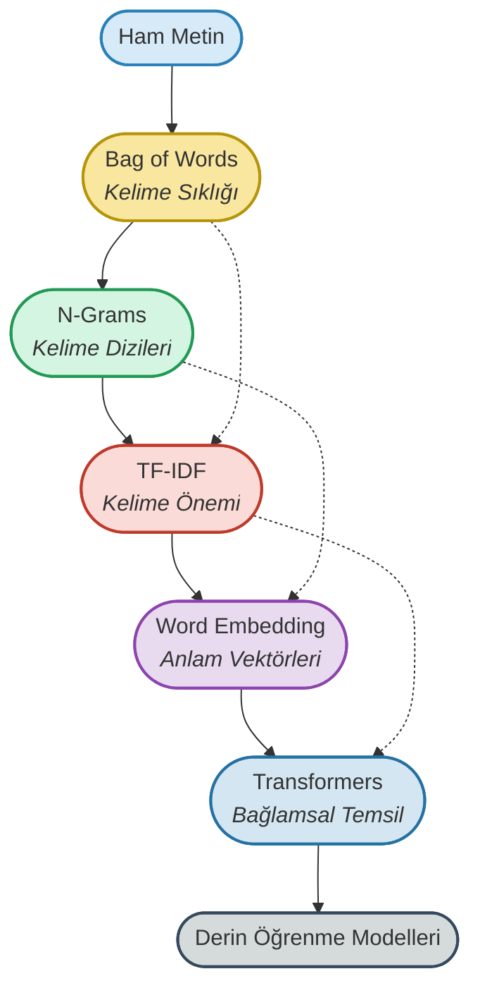
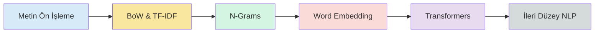

# 02. Metin Temsili (Text Representation)

## 🎯 Metin Temsili Yolculuğu

<p align="center">
  <b>Ham metinlerden sayısal vektörlere: NLP modellerinin anlayabileceği dile dönüşüm!</b>
</p>



---

## 📊 Proje Özeti

Bu klasörde, **NLP'de metin temsili yöntemleri** sıfırdan ileri seviyeye kadar profesyonel şekilde uygulanmaktadır.  
Çalışmalar, **IMDB film yorumları** ve **SMS spam** veri setleri üzerinde, endüstri standardı Python kütüphaneleri (scikit-learn, gensim, transformers, vb.) ve modern NLP teknikleriyle gerçekleştirilmiştir.

### Ana Konular:
- Bag of Words (BoW) ile temel metin vektörleştirme
- N-Grams ile kelime dizilerini yakalama
- TF-IDF ile kelimelerin önem derecelerini hesaplama
- Word Embedding ile anlamsal kelime vektörleri
- Transformers ile bağlamsal metin temsili

---

## 🌟 Metin Temsili Yöntemleri & Flashcardlar

### 1. **Bag of Words (BoW)**
- **Amaç:** Metni kelime sıklıklarına göre sayısal vektöre dönüştürmek.
- **Özellikler:**
  - Kelime sırası dikkate alınmaz
  - Basit ve hızlı
  - Seyrek (sparse) matris üretir
- **Kullanım Alanları:** Metin sınıflandırma, spam tespiti, duygu analizi
- **Kod:**
  ```python
  from sklearn.feature_extraction.text import CountVectorizer
  
  corpus = ["NLP çok güçlü", "NLP ile metin analizi", "Metin madenciliği harika"]
  vectorizer = CountVectorizer()
  X = vectorizer.fit_transform(corpus)
  
  print(vectorizer.get_feature_names_out())
  print(X.toarray())
  # Çıktı: Her kelime için sıklık değerleri
  ```
- <div style="border:1px solid #B7950B; border-radius:8px; padding:12px; background:#FFFBEA; margin:10px 0;">
  <b>Soru:</b> BoW yönteminin en büyük dezavantajı nedir?<br>
  <b>Cevap:</b> Kelime sırasını ve bağlamı göz ardı eder. "Kedi köpeği kovaladı" ile "Köpek kediyi kovaladı" aynı vektörle temsil edilir.
  </div>

---

### 2. **N-Grams**
- **Amaç:** Ardışık n kelimelik grupları yakalayarak kelimelerin birlikte kullanımını modellemek.
- **Özellikler:**
  - Unigram (1 kelime), Bigram (2 kelime), Trigram (3 kelime)
  - Kelime sırasını kısmen korur
  - Daha zengin özellik uzayı
- **Kullanım Alanları:** Dil modelleme, otomatik tamamlama, anahtar kelime çıkarımı
- **Kod:**
  ```python
  from sklearn.feature_extraction.text import CountVectorizer
  
  corpus = ["makine öğrenmesi çok eğlenceli", "derin öğrenme NLP için güçlü"]
  
  # Bigram (2-gram) oluşturma
  vectorizer = CountVectorizer(ngram_range=(2, 2))
  X = vectorizer.fit_transform(corpus)
  
  print(vectorizer.get_feature_names_out())
  # Çıktı: ['derin öğrenme', 'için güçlü', 'makine öğrenmesi', 'nlp için', 'öğrenme nlp', 'öğrenmesi çok', 'çok eğlenceli']
  ```
- <div style="border:1px solid #229954; border-radius:8px; padding:12px; background:#F0FDF4; margin:10px 0;">
  <b>Soru:</b> N-gram boyutu arttıkça ne gibi bir problem ortaya çıkar?<br>
  <b>Cevap:</b> Özellik uzayı çok büyür ve seyreklik (sparsity) artar. Bu da hesaplama maliyetini artırır ve overfitting riskini yükseltir.
  </div>

---

### 3. **TF-IDF (Term Frequency - Inverse Document Frequency)**
- **Amaç:** Kelimelerin önem derecelerini hesaplayarak ayırt edici kelimeleri öne çıkarmak.
- **Formül:**
  - **TF (Term Frequency):** Bir kelimenin dokümandaki sıklığı
  - **IDF (Inverse Document Frequency):** Kelimenin nadir bulunma derecesi
  - **TF-IDF = TF × IDF**
- **Özellikler:**
  - Her dokümanda sık geçen kelimeler (ör: "ve", "ama") düşük skor alır
  - Nadir ve ayırt edici kelimeler yüksek skor alır
- **Kullanım Alanları:** Anahtar kelime çıkarımı, doküman benzerliği, bilgi erişimi
- **Kod:**
  ```python
  from sklearn.feature_extraction.text import TfidfVectorizer
  
  corpus = [
      "Köpek çok tatlı bir hayvandır",
      "Kedi çok tatlı hayvanlardır",
      "İnekler süt üretirler",
      "Kuşlar göç eder"
  ]
  
  vectorizer = TfidfVectorizer()
  X = vectorizer.fit_transform(corpus)
  
  print(vectorizer.get_feature_names_out())
  print(X.toarray())
  # Çıktı: Her kelime için TF-IDF skorları
  ```
- <div style="border:1px solid #C0392B; border-radius:8px; padding:12px; background:#FEF5F5; margin:10px 0;">
  <b>Soru:</b> TF-IDF'in BoW'a göre avantajı nedir?<br>
  <b>Cevap:</b> TF-IDF, sık geçen ama anlamsız kelimelerin etkisini azaltır ve ayırt edici kelimelere daha fazla ağırlık verir. Bu sayede daha anlamlı özellikler elde edilir.
  </div>

---

### 4. **Word Embedding (Kelime Gömme)**
- **Amaç:** Kelimeleri yoğun (dense) ve anlamsal olarak zengin vektörlerle temsil etmek.
- **Popüler Yöntemler:**
  - **Word2Vec (Google):** CBOW ve Skip-gram modelleri
  - **FastText (Facebook/Meta):** Karakter n-gramlarını kullanır
  - **GloVe (Stanford):** Küresel kelime eş-oluşum matrisi
- **Özellikler:**
  - Anlamsal benzerlik yakalar (ör: "kral" - "kraliçe" ≈ "adam" - "kadın")
  - Düşük boyutlu yoğun vektörler (genelde 100-300 boyut)
  - Transfer learning için kullanılabilir
- **Kullanım Alanları:** Metin sınıflandırma, duygu analizi, makine çevirisi, soru-cevap sistemleri
- **Kod:**
  ```python
  from gensim.models import Word2Vec
  
  # Örnek cümleler
  sentences = [
      ["makine", "öğrenmesi", "çok", "eğlenceli"],
      ["derin", "öğrenme", "nlp", "için", "güçlü"],
      ["yapay", "zeka", "geleceğin", "teknolojisi"]
  ]
  
  # Word2Vec modelini eğit
  model = Word2Vec(sentences, vector_size=100, window=5, min_count=1, workers=4)
  
  # Benzer kelimeleri bul
  similar = model.wv.most_similar("öğrenme", topn=3)
  print(similar)
  
  # Kelime vektörü
  vector = model.wv["makine"]
  print(vector.shape)  # (100,)
  ```
- <div style="border:1px solid #8E44AD; border-radius:8px; padding:12px; background:#F9F5FC; margin:10px 0;">
  <b>Soru:</b> Word2Vec ile FastText arasındaki temel fark nedir?<br>
  <b>Cevap:</b> Word2Vec kelimeleri tek birim olarak işlerken, FastText kelimeleri karakter n-gramlarına böler. Bu sayede FastText, sözlükte olmayan (OOV) kelimeler için de vektör üretebilir.
  </div>

---

### 5. **Transformers (Bağlamsal Metin Temsili)**
- **Amaç:** Her kelimenin bağlamına göre dinamik vektör temsili oluşturmak.
- **Popüler Modeller:**
  - **BERT (Bidirectional Encoder Representations from Transformers)**
  - **GPT (Generative Pre-trained Transformer)**
  - **RoBERTa, ALBERT, DistilBERT**
  - **Türkçe Modeller:** BERTurk, mBERT
- **Özellikler:**
  - Attention mekanizması ile bağlamsal anlam
  - Transfer learning (ön eğitimli modeller)
  - Son teknoloji (state-of-the-art) performans
  - Aynı kelime farklı cümlelerde farklı vektörlerle temsil edilir
- **Kullanım Alanları:** Tüm NLP görevleri (sınıflandırma, NER, soru-cevap, özetleme, vb.)
- **Kod:**
  ```python
  from transformers import AutoTokenizer, AutoModel
  import torch
  
  # Model ve tokenizer yükle
  model_name = "bert-base-uncased"
  tokenizer = AutoTokenizer.from_pretrained(model_name)
  model = AutoModel.from_pretrained(model_name)
  
  # Metin
  text = "Transformers are powerful for NLP"
  
  # Tokenize et
  inputs = tokenizer(text, return_tensors="pt")
  
  # Model çıktısı
  with torch.no_grad():
      outputs = model(**inputs)
  
  # Son katman gizli durumları (hidden states)
  embeddings = outputs.last_hidden_state
  print(embeddings.shape)  # torch.Size([1, sequence_length, 768])
  ```
- <div style="border:1px solid #2471A3; border-radius:8px; padding:12px; background:#F0F8FF; margin:10px 0;">
  <b>Soru:</b> BERT'in Word2Vec'e göre en önemli avantajı nedir?<br>
  <b>Cevap:</b> BERT bağlamsal (contextual) temsil oluşturur. Yani "elma" kelimesi "meyve elma" ve "göz bebeği elma" cümlelerinde farklı vektörlerle temsil edilir. Word2Vec'te ise her kelime için sabit bir vektör vardır.
  </div>

---

## 📂 Klasör İçeriği

- `01. bow-bagofwords.ipynb` : Bag of Words yöntemi ile metin vektörleştirme ve IMDB veri seti üzerinde sınıflandırma
- `02. n-grams.ipynb` : N-Gram kavramı ve uygulamaları (unigram, bigram, trigram)
- `03. tf_idf.ipynb` : TF-IDF ile kelime önem skorları ve anahtar kelime çıkarımı
- `04_word_embedding.ipynb` : Word2Vec, FastText ve GloVe ile kelime gömme yöntemleri
- `05. transformers.ipynb` : BERT ve Transformers ile bağlamsal metin temsili
- `IMDB Dataset.csv` : IMDB film yorumları veri seti (duygu analizi)
- `sms_spam.csv` : SMS spam tespiti veri seti

---

## 🔄 Yöntemler Arası Karşılaştırma

| Yöntem | Boyut | Yoğunluk | Bağlamsal | Hız | Kullanım Kolaylığı |
|--------|-------|----------|-----------|-----|-------------------|
| **BoW** | Çok Yüksek | Seyrek | ❌ | ⚡⚡⚡ | ⭐⭐⭐ |
| **N-Grams** | Çok Yüksek | Seyrek | Kısmen | ⚡⚡ | ⭐⭐⭐ |
| **TF-IDF** | Çok Yüksek | Seyrek | ❌ | ⚡⚡⚡ | ⭐⭐⭐ |
| **Word Embedding** | Düşük (100-300) | Yoğun | ❌ | ⚡⚡ | ⭐⭐ |
| **Transformers** | Orta (768) | Yoğun | ✅ | ⚡ | ⭐ |

---

## 🚀 Hangi Yöntemi Ne Zaman Kullanmalı?

### **BoW / TF-IDF**
- ✅ Basit ve hızlı prototipleme
- ✅ Sınırlı veri ve hesaplama kaynağı
- ✅ Metin sınıflandırma, spam tespiti
- ❌ Bağlamsal anlam gerekli değilse

### **N-Grams**
- ✅ Kelime sırası önemli
- ✅ Dil modelleme, otomatik tamamlama
- ✅ Anahtar kelime çıkarımı
- ❌ Çok büyük veri setlerinde dikkatli kullanılmalı

### **Word Embedding**
- ✅ Anlamsal benzerlik önemli
- ✅ Orta ölçekli veri setleri
- ✅ Transfer learning ile ön eğitimli modeller
- ❌ Bağlamsal anlam gerekiyorsa Transformers tercih edilmeli

### **Transformers**
- ✅ En yüksek performans gerekli
- ✅ Bağlamsal anlam kritik
- ✅ Yeterli hesaplama kaynağı mevcut
- ✅ Transfer learning ile hızlı başlangıç
- ❌ Yüksek hesaplama maliyeti

---

## 💡 Kaynaklar

- [scikit-learn Text Feature Extraction](https://scikit-learn.org/stable/modules/feature_extraction.html#text-feature-extraction)
- [Gensim Word2Vec Documentation](https://radimrehurek.com/gensim/models/word2vec.html)
- [Hugging Face Transformers](https://huggingface.co/docs/transformers/index)
- [Stanford NLP Course](https://web.stanford.edu/class/cs224n/)
- [FastText Documentation](https://fasttext.cc/)

---

## 🎓 Öğrenme Yol Haritası



---

> **Metin temsili, NLP'nin kalbidir. Doğru temsil yöntemi seçimi, model başarısının %80'ini belirler!**

---

## 📝 Notlar

- Tüm notebook'larda **adım adım açıklamalar** ve **flashcard** tarzı öğrenme notları bulunmaktadır
- Her yöntem için **gerçek veri setleri** kullanılmıştır
- **Görselleştirmeler** ve **karşılaştırmalar** ile kavramlar pekiştirilmiştir
- **Best practices** ve **production tips** eklenmiştir