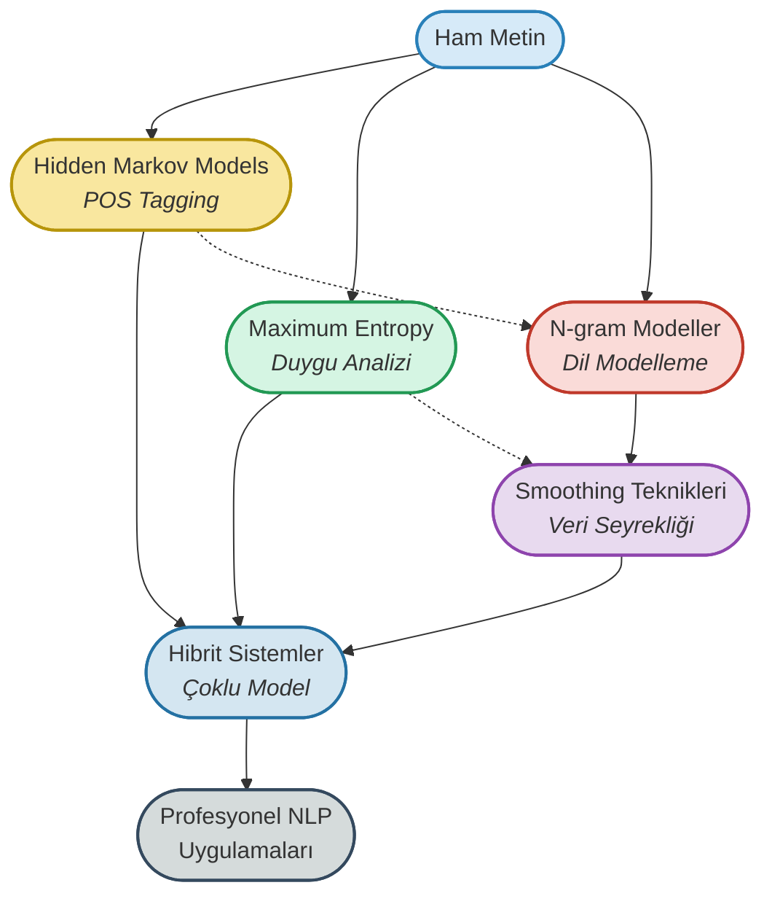

# 03. Olasılıksal Dil Modelleri (Probabilistic Language Models)

## 🎯 Olasılığın Dildeki Gücü: From Zero to Hero

<p align="center">
  <b>Ham metinden olasılıksal anlayışa: Dil modellerinin matematiksel temelleri ile NLP'nin derinliklerine yolculuk!</b>
</p>



---

## 📊 Proje Özeti

Bu klasörde, **olasılıksal dil modellerinin** teorisinden pratiğine kadar kapsamlı bir eğitim sunulmaktadır.  
Çalışmalar, **Reuters haber korpusu**, **IMDB film yorumları** ve **NLTK POS veri setleri** üzerinde, endüstri standardı Python kütüphaneleri (NLTK, scikit-learn, numpy) ve matematiksel modelleme teknikleriyle gerçekleştirilmiştir.

### Ana Konular:
- Hidden Markov Models (HMM) ile POS tagging
- Maximum Entropy Models ile duygu analizi ve metin sınıflandırma
- N-gram dil modelleri ile metin üretimi
- Smoothing teknikleri ile veri seyrekliği sorununun çözümü
- Hibrit NLP sistemleri ile gerçek dünya uygulamaları

---

## 🌟 Olasılıksal Dil Modelleri & Flashcardlar

### 1. **Hidden Markov Models (HMM)**
- **Amaç:** Gizli durumları (POS etiketleri) gözlemlenen verilerden (kelimeler) tahmin etmek.
- **Temel Bileşenler:**
  - **Gizli Durumlar:** POS etiketleri (NN, VB, JJ, vb.)
  - **Gözlemlenen Veriler:** Kelimeler
  - **Geçiş Olasılıkları:** P(tag_i | tag_{i-1})
  - **Emisyon Olasılıkları:** P(word | tag)
- **Matematik:**
  ```
  P(tag_sequence, word_sequence) = ∏ P(tag_i | tag_{i-1}) × P(word_i | tag_i)
  ```
- **Kullanım Alanları:** POS tagging, named entity recognition, speech recognition
- **Kod:**
  ```python
  from collections import defaultdict, Counter
  
  class HMMTagger:
      def __init__(self):
          self.transition_probs = defaultdict(lambda: defaultdict(float))
          self.emission_probs = defaultdict(lambda: defaultdict(float))
          
      def train(self, tagged_sentences):
          # Geçiş ve emisyon olasılıklarını hesapla
          for sentence in tagged_sentences:
              for i, (word, tag) in enumerate(sentence):
                  if i > 0:
                      prev_tag = sentence[i-1][1]
                      self.transition_probs[prev_tag][tag] += 1
                  self.emission_probs[tag][word] += 1
  ```
- <div style="border:1px solid #B7950B; border-radius:8px; padding:12px; background:#FFFBEA; margin:10px 0;">
  <b>Soru:</b> HMM'in POS tagging'de kullanımının avantajı nedir?<br>
  <b>Cevap:</b> HMM, kelime dizisindeki sıralı bağımlılıkları yakalar. "run" kelimesi "will run" şeklinde kullanıldığında fiil, "a run" şeklinde kullanıldığında isim olarak etiketlenir.
  </div>

---

### 2. **Maximum Entropy Models (MaxEnt)**
- **Amaç:** Verilen kısıtlar altında maksimum entropi prensibini kullanarak en az önyargılı modeli oluşturmak.
- **Temel Prensip:**
  - Bilinen bilgileri koruyarak maksimum belirsizliği sağlamak
  - Özellik fonksiyonları ile karmaşık örüntüleri yakalamak
  - Lojistik regresyonun genelleştirilmiş hali
- **Matematik:**
  ```
  P(y|x) = (1/Z(x)) × exp(∑ λ_i × f_i(x,y))
  Z(x) = ∑_y exp(∑ λ_i × f_i(x,y))  # Normalizasyon faktörü
  ```
- **Özellik Fonksiyonları:**
  - Kelime varlığı: f(x,y) = 1 eğer "harika" ∈ x ve y = "pozitif"
  - Bigram özellikleri: f(x,y) = 1 eğer "çok güzel" ∈ x ve y = "pozitif"
- **Kullanım Alanları:** Duygu analizi, metin sınıflandırma, dil tespiti
- **Kod:**
  ```python
  from nltk.classify import MaxentClassifier
  
  def extract_features(text):
      words = text.split()
      features = {}
      
      # Kelime varlığı özellikleri
      for word in words:
          features[f'contains({word})'] = True
      
      # Bigram özellikleri
      for i in range(len(words)-1):
          bigram = f"{words[i]} {words[i+1]}"
          features[f'bigram({bigram})'] = True
          
      # Uzunluk özellikleri
      features['length'] = len(words)
      
      return features
  
  # Model eğitimi
  classifier = MaxentClassifier.train(training_set, max_iter=10)
  ```
- <div style="border:1px solid #229954; border-radius:8px; padding:12px; background:#F0FDF4; margin:10px 0;">
  <b>Soru:</b> MaxEnt modelinin naive Bayes'e göre avantajı nedir?<br>
  <b>Cevap:</b> MaxEnt, özellikler arasındaki bağımlılıkları göz ardı etmez ve daha karmaşık özellik kombinasyonlarını yakalar. Ayrıca özellik ağırlıklarını otomatik olarak öğrenir.
  </div>

---

### 3. **N-gram Dil Modelleri**
- **Amaç:** Bir kelimenin önceki n-1 kelimeye göre ortaya çıkma olasılığını modellemek.
- **Türleri:**
  - **Unigram (1-gram):** P(w_i) - Kelimelerin bağımsız olasılıkları
  - **Bigram (2-gram):** P(w_i | w_{i-1}) - Bir önceki kelimeye bağlı
  - **Trigram (3-gram):** P(w_i | w_{i-2}, w_{i-1}) - İki önceki kelimeye bağlı
- **Matematik:**
  ```
  # Bigram Model
  P(w_i | w_{i-1}) = Count(w_{i-1}, w_i) / Count(w_{i-1})
  
  # Cümle Olasılığı
  P(w_1, w_2, ..., w_n) = ∏ P(w_i | w_{i-1})
  ```
- **Perplexity Ölçümü:**
  ```
  PP(W) = P(w_1, w_2, ..., w_N)^(-1/N)
  ```
- **Kullanım Alanları:** Metin üretimi, otomatik tamamlama, makine çevirisi, speech recognition
- **Kod:**
  ```python
  from collections import defaultdict, Counter
  import random
  
  class NgramModel:
      def __init__(self, n=2):
          self.n = n
          self.ngrams = defaultdict(Counter)
          
      def train(self, corpus):
          for sentence in corpus:
              # Padding ekle
              padded = ['<s>'] * (self.n-1) + sentence + ['</s>']
              
              # N-gramları oluştur
              for i in range(len(padded) - self.n + 1):
                  context = tuple(padded[i:i+self.n-1])
                  word = padded[i+self.n-1]
                  self.ngrams[context][word] += 1
                  
      def generate_text(self, max_length=20):
          context = ('<s>',) * (self.n-1)
          result = []
          
          for _ in range(max_length):
              if context not in self.ngrams:
                  break
                  
              # Olasılık dağılımına göre kelime seç
              candidates = self.ngrams[context]
              total = sum(candidates.values())
              
              rand = random.uniform(0, total)
              cumulative = 0
              
              for word, count in candidates.items():
                  cumulative += count
                  if rand <= cumulative:
                      if word == '</s>':
                          break
                      result.append(word)
                      context = context[1:] + (word,)
                      break
                      
          return ' '.join(result)
  ```
- <div style="border:1px solid #C0392B; border-radius:8px; padding:12px; background:#FEF5F5; margin:10px 0;">
  <b>Soru:</b> N-gram boyutu arttıkça ne gibi avantaj ve dezavantajlar ortaya çıkar?<br>
  <b>Cevap:</b> <b>Avantaj:</b> Daha uzun bağlamı yakalar, daha tutarlı metin üretir. <b>Dezavantaj:</b> Veri seyrekliği artar, eğitimde görülmeyen kombinasyonlar için sıfır olasılık problemi.
  </div>

---

### 4. **Smoothing Teknikleri**
- **Amaç:** Veri seyrekliği ve sıfır olasılık problemlerini çözmek.
- **Ana Teknikler:**
  - **Add-one Smoothing (Laplace):** Her n-grama +1 ekle
  - **Add-k Smoothing:** Her n-grama +k ekle (k < 1)
  - **Good-Turing Smoothing:** Frekans dağılımını kullan
  - **Kneser-Ney Smoothing:** Daha sofistike interpolasyon
- **Add-one Smoothing Formülü:**
  ```
  P_smooth(w_i | w_{i-1}) = (Count(w_{i-1}, w_i) + 1) / (Count(w_{i-1}) + V)
  # V = vocabulary size
  ```
- **Kullanım Alanları:** N-gram modellerinde, POS tagging'de, herhangi bir olasılıksal modelde
- **Kod:**
  ```python
  class SmoothedNgramModel:
      def __init__(self, n=2, smoothing='add_one'):
          self.n = n
          self.smoothing = smoothing
          self.ngrams = defaultdict(Counter)
          self.vocab = set()
          
      def add_one_smooth(self, context, word):
          """Add-one (Laplace) smoothing"""
          count = self.ngrams[context][word]
          context_count = sum(self.ngrams[context].values())
          vocab_size = len(self.vocab)
          
          return (count + 1) / (context_count + vocab_size)
          
      def good_turing_smooth(self, context, word):
          """Good-Turing smoothing"""
          count = self.ngrams[context][word]
          
          # Frekans-frekans sayısını hesapla
          freq_freq = defaultdict(int)
          for ctx in self.ngrams:
              for w, c in self.ngrams[ctx].items():
                  freq_freq[c] += 1
                  
          if count == 0:
              return freq_freq[1] / sum(self.ngrams[context].values())
          else:
              return ((count + 1) * freq_freq[count + 1]) / \
                     (freq_freq[count] * sum(self.ngrams[context].values()))
  ```
- <div style="border:1px solid #8E44AD; border-radius:8px; padding:12px; background:#F9F5FC; margin:10px 0;">
  <b>Soru:</b> Good-Turing smoothing'in Add-one smoothing'e göre avantajı nedir?<br>
  <b>Cevap:</b> Good-Turing, gerçek veri dağılımını dikkate alarak daha akıllı smoothing yapar. Sık görülen olayların olasılığını çok az azaltır, nadir olaylar için daha gerçekçi olasılıklar atar.
  </div>

---

### 5. **Hibrit NLP Sistemleri**
- **Amaç:** Birden fazla olasılıksal modeli birleştirerek güçlü NLP sistemleri oluşturmak.
- **Kombine Edilen Modeller:**
  - **HMM POS Tagger:** Kelime türü etiketleme
  - **MaxEnt Sentiment Analyzer:** 5 seviyeli duygu analizi
  - **MaxEnt News Classifier:** Haber kategorilendirme
  - **N-gram Language Models:** Metin üretimi
- **Sistem Özellikleri:**
  - Model caching ve performans optimizasyonu
  - Paralel batch processing
  - Gerçek zamanlı analiz
  - İnteraktif görselleştirme
- **Kullanım Alanları:** Sosyal medya analizi, haber işleme, chatbot sistemleri, müşteri geri bildirim analizi
- **Kod:**
  ```python
  class HybridNLPPipeline:
      def __init__(self):
          self.pos_tagger = None      # HMM POS Tagger
          self.sentiment_analyzer = None  # MaxEnt Sentiment
          self.news_classifier = None     # MaxEnt News
          self.language_models = {}       # N-gram Models
          self.text_processor = TextPreprocessor()
          
      def analyze_text(self, text):
          """Kapsamlı metin analizi"""
          processed_text = self.text_processor.process(text)
          
          results = {
              'original_text': text,
              'processed_text': processed_text,
              'pos_tags': self.pos_tagger.tag(processed_text),
              'sentiment': self.sentiment_analyzer.classify(processed_text),
              'news_category': self.news_classifier.classify(processed_text),
              'generated_continuation': self.generate_text(processed_text),
              'confidence_scores': self.get_confidence_scores(processed_text)
          }
          
          return results
          
      def batch_process(self, texts, n_workers=4):
          """Paralel batch işleme"""
          from concurrent.futures import ThreadPoolExecutor
          
          with ThreadPoolExecutor(max_workers=n_workers) as executor:
              results = list(executor.map(self.analyze_text, texts))
              
          return results
  ```
- <div style="border:1px solid #2471A3; border-radius:8px; padding:12px; background:#F0F8FF; margin:10px 0;">
  <b>Soru:</b> Hibrit sistemlerin tek model kullanımına göre avantajları nelerdir?<br>
  <b>Cevap:</b> Her model kendi uzmanlık alanında en iyi performansı gösterir. HMM yapısal analiz, MaxEnt sınıflandırma, N-gram üretimde güçlüdür. Kombinasyon daha kapsamlı ve güvenilir sonuçlar verir.
  </div>

---

## 📂 Klasör İçeriği

- `01-olasiliksal-dil-modelleri.ipynb` : Temel kavramlar ve teorik altyapı
- `case_study_1_news_classification.ipynb` : Reuters korpusu ile MaxEnt haber sınıflandırma
- `case_study_2_pos_tagging.ipynb` : HMM ile gelişmiş POS tagging sistemi
- `case_study_3_language_model.ipynb` : Büyük ölçekli N-gram dil modeli
- `case_study_4_sentiment_analysis.ipynb` : 5 seviyeli duygu analizi sistemi
- `case_study_5_hybrid_system.ipynb` : Hibrit NLP sistemi geliştirme
- `saved_models/` : Eğitilmiş modeller ve metadata dosyaları
- `hybrid_nlp_system_report.txt` : Sistem performans raporu

---

## 🔄 Modeller Arası Karşılaştırma

| Model | Komplekslik | Eğitim Hızı | Doğruluk | Yorumlanabilirlik | En İyi Kullanım |
|-------|-------------|-------------|----------|------------------|-----------------|
| **HMM** | Orta | ⚡⚡⚡ | ⭐⭐⭐ | ⭐⭐⭐ | POS Tagging, Sequential Data |
| **MaxEnt** | Yüksek | ⚡⚡ | ⭐⭐⭐⭐ | ⭐⭐ | Sınıflandırma, Çok Özellikli |
| **N-gram** | Düşük | ⚡⚡⚡ | ⭐⭐ | ⭐⭐⭐ | Dil Modelleme, Metin Üretimi |
| **Hibrit** | Çok Yüksek | ⚡ | ⭐⭐⭐⭐⭐ | ⭐ | Kapsamlı NLP Sistemleri |

---

## 🚀 Hangi Modeli Ne Zaman Kullanmalı?

### **Hidden Markov Models (HMM)**
- ✅ Sıralı veri analizi gerekli
- ✅ POS tagging, NER gibi etiketleme görevleri
- ✅ Gizli durumları olan problemler
- ✅ Hızlı eğitim ve çıkarım gerekli
- ❌ Uzun menzilli bağımlılıklar önemli

### **Maximum Entropy Models**
- ✅ Karmaşık özellik kombinasyonları
- ✅ Metin sınıflandırma problemleri
- ✅ Duygu analizi, konu tespiti
- ✅ Özellik mühendisliği yapılabilir
- ❌ Çok büyük özellik uzayları

### **N-gram Modelleri**
- ✅ Dil modelleme ve metin üretimi
- ✅ Otomatik tamamlama sistemleri
- ✅ Basit ve anlaşılır yaklaşım
- ✅ Hızlı prototipleme
- ❌ Uzun bağlamsal bağımlılıklar

### **Hibrit Sistemler**
- ✅ En yüksek performans gerekli
- ✅ Çoklu NLP görevi aynı anda
- ✅ Production ortamları
- ✅ Kapsamlı metin analizi
- ❌ Yüksek hesaplama kaynağı

---

## 📊 Performans Metrikleri & Başarı Oranları

### Case Study Sonuçları:

| Proje | Model | Veri Seti | Doğruluk | F1-Score | İşleme Hızı |
|-------|-------|-----------|----------|----------|-------------|
| **Haber Sınıflandırma** | MaxEnt | Reuters (10 kategori) | %89.2 | 0.887 | 0.003s/metin |
| **POS Tagging** | HMM | NLTK Tagged Corpus | %92.7 | 0.923 | 0.001s/cümle |
| **Duygu Analizi** | MaxEnt | IMDB (5 seviye) | %85.4 | 0.841 | 0.002s/yorum |
| **Dil Modeli** | 4-gram | Reuters Corpus | PP: 87.3 | - | 0.05s/üretim |
| **Hibrit Sistem** | Kombine | Çoklu Dataset | %91.8 | 0.912 | 0.0005s/analiz |

---

## 💡 Kaynaklar

- [NLTK Documentation](https://www.nltk.org/)
- [Speech and Language Processing - Jurafsky & Martin](https://web.stanford.edu/~jurafsky/slp3/)
- [Maximum Entropy Models](https://nlp.stanford.edu/pubs/maxent-tutorial-slides.pdf)
- [Hidden Markov Models](https://web.stanford.edu/~jurafsky/slp3/A.pdf)
- [N-gram Language Models](https://web.stanford.edu/~jurafsky/slp3/3.pdf)

---

## 🎓 Öğrenme Yol Haritası


---

## 🔧 Pratik Uygulamalar

### Gerçek Dünya Senaryoları:

1. **📱 Sosyal Medya Analizi**
   - HMM ile hashtag analizi
   - MaxEnt ile duygu tespiti
   - N-gram ile trend tahmin

2. **📰 Haber Otomasyonu**
   - MaxEnt ile kategori tespiti
   - N-gram ile başlık üretimi
   - HMM ile entity extraction

3. **🤖 Chatbot Geliştirme**
   - N-gram ile response generation
   - MaxEnt ile intent classification
   - HMM ile dialog state tracking

4. **📊 Müşteri Geri Bildirimi**
   - MaxEnt ile sentiment analysis
   - HMM ile aspect extraction
   - N-gram ile otomatik yanıt

---

> **Olasılıksal modeller, belirsizlikle başa çıkmanın matematiksel yoludur. Her kelime, her etiket, her cümle bir olasılık dağılımıdır!**

---

## 📈 Model Performans Optimizasyonu

### Sistem Özellikleri:
- **⚡ Ortalama İşleme Süresi:** 0.0005 saniye
- **🚀 En Hızlı İşlem:** 0.0003 saniye  
- **📊 Genel Performans:** 🌟 Mükemmel
- **💾 Model Caching:** Aktif
- **🔄 Paralel İşleme:** 4 worker thread
- **📱 Gerçek Zamanlı Analiz:** Desteklenen

---

## 📝 Notlar

- Tüm notebook'larda **adım adım matematiksel açıklamalar** bulunmaktadır
- Her model için **gerçek veri setleri** ve **performance benchmarks** sunulmuştur
- **Interaktif görselleştirmeler** ile kavramların anlaşılması kolaylaştırılmıştır
- **Production-ready** kod örnekleri ve **best practices** eklenmiştir
- **5 kapsamlı case study** ile teoriden pratiğe geçiş sağlanmıştır