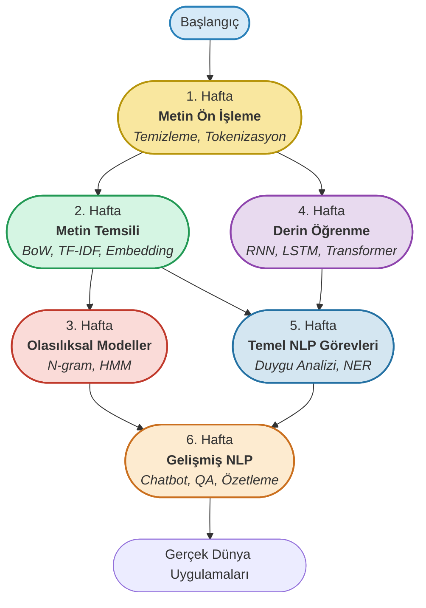

<!-- HERO SECTION -->
<p align="center">
  <br/><br/>
  <span style="font-size:2.8em; font-weight:bold; letter-spacing:1px; color:#0b6efd; text-shadow: 2px 2px 8px #b3d1ff;">
    🚀 NLP Bootcamp: From Zero to Hero 🚀
  </span>
  <br/>
  <span style="font-size:1.7em; color:#222; font-weight:bold;">
    6 Haftada Sıfırdan İleriye Doğal Dil İşleme Yolculuğu
  </span>
  <br/><br/>
  
  
  
  
</p>

<p align="center">
  
  
  
  
  
</p>

---

<!-- FLASHCARD BİLGİ KUTULARI (2x3 GRID, pastel renkli, ikonsuz) -->
<table align="center">
  <tr>
    <td width="300" align="center" valign="top" style="background:#e3f2fd; border-radius:14px; font-size:1.13em; padding:18px;">
      <b>NLP Nedir?</b><br/>
      Doğal Dil İşleme (NLP), insan dilini bilgisayarların anlayıp işleyebileceği forma dönüştüren yapay zeka dalıdır. Metin ve konuşma verisinden anlam çıkarır, otomasyon ve analiz sağlar.
    </td>
    <td width="300" align="center" valign="top" style="background:#fff3e0; border-radius:14px; font-size:1.13em; padding:18px;">
      <b>Uygulama Alanları</b><br/>
      Chatbotlar, arama motorları, otomatik özetleme, makine çevirisi, duygu analizi, spam tespiti, öneri sistemleri ve daha fazlası.
    </td>
    <td width="300" align="center" valign="top" style="background:#e8f5e9; border-radius:14px; font-size:1.13em; padding:18px;">
      <b>Güncel Trendler</b><br/>
      BERT, GPT, büyük dil modelleri, çok dilli öğrenme, transfer öğrenme ve modern NLP yaklaşımları.
    </td>
  </tr>
  <tr>
    <td width="300" align="center" valign="top" style="background:#f3e5f5; border-radius:14px; font-size:1.13em; padding:18px;">
      <b>Kullanılan Araçlar</b><br/>
      Jupyter Notebook, Python, spaCy, Gensim, NLTK, scikit-learn ve daha fazlası.
    </td>
    <td width="300" align="center" valign="top" style="background:#e0f7fa; border-radius:14px; font-size:1.13em; padding:18px;">
      <b>Bootcamp Yapısı</b><br/>
      6 haftada adım adım modüller, her hafta interaktif Jupyter Notebook'lar, gerçek veri setleri ve uygulamalı projeler ile öğrenme.
    </td>
    <td width="300" align="center" valign="top" style="background:#fffde7; border-radius:14px; font-size:1.13em; padding:18px;">
      <b>Gerçek Dünya Etkisi</b><br/>
      NLP; sağlık, finans, eğitim, sosyal medya ve müşteri hizmetleri gibi birçok sektörde otomasyon ve akıllı analiz sağlar.
    </td>
  </tr>
</table>

---

<!-- SİSTEM MİMARİSİ & YOLCULUK -->
## 🚦 6 Haftada NLP Yolculuğu

<p align="center">
  <b>Her hafta yeni bir seviye, yeni bir beceri!</b>
</p>

<!-- Modern, renkli ve 3x2 grid formatında mermaid diyagramı -->


---

## 🌍 Gerçek Dünya Uygulamaları

<p align="center">
   Google Translate &nbsp;&nbsp;
   Siri/Alexa &nbsp;&nbsp;
   Sosyal Medya Analitiği &nbsp;&nbsp;
   Sağlıkta NLP
</p>

---

## 📅 Haftalık Yol Haritası

| Hafta | Modül | İçerik |
|:-:|:---|:---|
| 1 | **01.metin-on-isleme** | Metin temizleme, tokenizasyon, stopword çıkarımı, kök bulma, lemmatizasyon, Türkçe morfoloji |
| 2 | **02.metin-temsili** | Bag-of-Words, N-gram, TF-IDF, Word Embedding |
| 3 | **03.olasiliksal-dil-modelleri** | N-gram modelleri, HMM, MaxEnt |
| 4 | **04.derin-ogrenme-dil-modelleri** | RNN, LSTM, Transformer tabanlı modeller |
| 5 | **05.temel-nlp-gorevleri** | Duygu analizi, sınıflandırma, NER, POS |
| 6 | **06.gelismis-nlp-gorevleri** | Chatbot, QA, özetleme, çeviri |

> **Not:** Her hafta yeni bir klasör ve içerik eklenecek. Takipte kal!

---

## 📚 01.metin-on-isleme Modülü

- **Tokenizasyon:** Metni kelime/cümlelere böl
- **Stopword Çıkarımı:** Anlamsız kelimeleri temizle
- **Kök/Lemma:** Kelimeleri köklerine indir
- **Türkçe Morfoloji:** Türkçe'ye özel işlemler

| Dosya | Açıklama |
|:---|:---|
| `01_veri_temizleme.py` | Temel metin temizleme fonksiyonları |
| `02_tokenizasyon.py` | Tokenizasyon örnekleri |
| `03_stop_words.py` | Stopword çıkarımı uygulamaları |
| `04_kok_lemmatizasyon.py` | Kök bulma ve lemmatizasyon örnekleri |

---

## 📂 Dizin Yapısı

```bash
nlp-pratikleri/
├── 01.metin-on-isleme/
│   ├── 01_veri_temizleme.py
│   ├── 02_tokenizasyon.py
│   ├── 03_stop_words.py
│   └── 04_kok_lemmatizasyon.py
│
├── requirements.txt
└── README.md
```

---

## 📦 Veri Setleri

- `IMDB_Dataset.csv`: Film yorumları (duygu analizi için)
- `sms_spam.csv`: SMS spam/ham sınıflandırma
- `amazon_reviews_tr.csv`: Amazon ürün yorumları (sınıflandırma ve duygu analizi)
- `turkish_movie_reviews.csv`: Türkçe film yorumları (duygu analizi)
- `turkish_news_ner.csv`: Türkçe haber metinleri (ad-öbek tanıma/NER)
- `turkish_twitter_sentiment.csv`: Türkçe tweetler (duygu analizi)
- `turkish_wikipedia_2023.txt`: Büyük ölçekli Türkçe Wikipedia metni (dil modeli eğitimi için)

---

## ⚡ Kurulum & Başlangıç

```bash
python -m venv venv
venv\Scripts\activate   # (veya Mac/Linux için: source venv/bin/activate)
pip install -r requirements.txt
```

---

## 💬 Katkı & Topluluk

- Her hafta yeni modül için katkı ve önerilere açığız!
- Sorularını, önerilerini ve pull request'lerini bekliyoruz.
- Bootcamp ilerledikçe, toplulukla birlikte büyüyoruz!

---

<div align="center" style="font-size:1.08em; color:#222; margin-top:32px;">
  <b>Hazırlayan:</b> Cemal Yüksel<br/>
  <b>Konsept:</b> Haftalık güncellenen, sıfırdan ileriye uygulamalı NLP Bootcamp.
  <br/><br/>
  <span style="font-size:0.92em; color:#888;">
    <i>
      <span style="font-size:0.80em;">
        Bu Jupyter Notebook'ların oluşumunda, BTK Akademi'de Kaan Can YILMAZ tarafından yayınlanan "Doğal Dil İşleme" eğitim modülü referans alınmıştır.
      </span>
    </i>
  </span>
</div>
