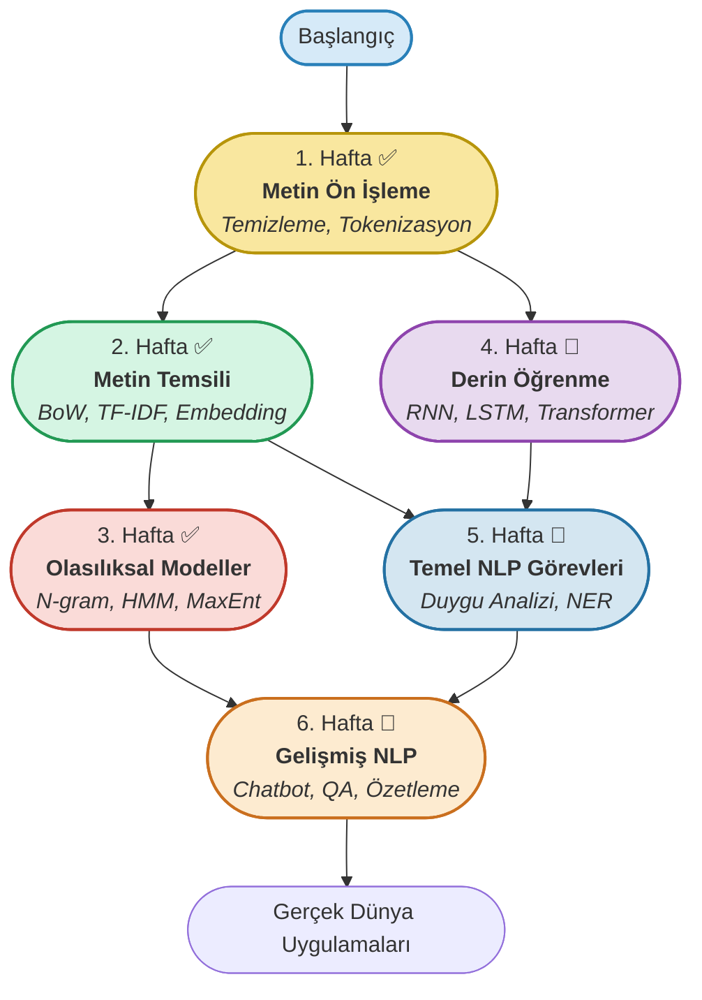

<!-- HERO SECTION -->
<p align="center">
  <br/><br/>
  <span style="font-size:2.8em; font-weight:bold; letter-spacing:1px; color:#0b6efd; text-shadow: 2px 2px 8px #b3d1ff;">
    🚀 NLP Bootcamp: From Zero to Hero 🚀
  </span>
  <br/>
  <span style="font-size:1.7em; color:#222; font-weight:bold;">
    6 Haftada Sıfırdan İleriye Doğal Dil İşleme Yolculuğu
  </span>
  <br/><br/>
  
  
  
  
</p>

<p align="center">
  
  
  
  
  
</p>

---

<!-- FLASHCARD BİLGİ KUTULARI (2x3 GRID, pastel renkli, ikonsuz) -->
<table align="center">
  <tr>
    <td width="300" align="center" valign="top" style="background:#e3f2fd; border-radius:14px; font-size:1.13em; padding:18px;">
      <b>NLP Nedir?</b><br/>
      Doğal Dil İşleme (NLP), insan dilini bilgisayarların anlayıp işleyebileceği forma dönüştüren yapay zeka dalıdır. Metin ve konuşma verisinden anlam çıkarır, otomasyon ve analiz sağlar.
    </td>
    <td width="300" align="center" valign="top" style="background:#fff3e0; border-radius:14px; font-size:1.13em; padding:18px;">
      <b>Uygulama Alanları</b><br/>
      Chatbotlar, arama motorları, otomatik özetleme, makine çevirisi, duygu analizi, spam tespiti, öneri sistemleri ve daha fazlası.
    </td>
    <td width="300" align="center" valign="top" style="background:#e8f5e9; border-radius:14px; font-size:1.13em; padding:18px;">
      <b>Güncel Trendler</b><br/>
      BERT, GPT, büyük dil modelleri, çok dilli öğrenme, transfer öğrenme ve modern NLP yaklaşımları.
    </td>
  </tr>
  <tr>
    <td width="300" align="center" valign="top" style="background:#f3e5f5; border-radius:14px; font-size:1.13em; padding:18px;">
      <b>Kullanılan Araçlar</b><br/>
      Jupyter Notebook, Python, spaCy, Gensim, NLTK, scikit-learn ve daha fazlası.
    </td>
    <td width="300" align="center" valign="top" style="background:#e0f7fa; border-radius:14px; font-size:1.13em; padding:18px;">
      <b>Bootcamp Yapısı</b><br/>
      6 haftada adım adım modüller, her hafta interaktif Jupyter Notebook'lar, gerçek veri setleri ve uygulamalı projeler ile öğrenme.
    </td>
    <td width="300" align="center" valign="top" style="background:#fffde7; border-radius:14px; font-size:1.13em; padding:18px;">
      <b>Gerçek Dünya Etkisi</b><br/>
      NLP; sağlık, finans, eğitim, sosyal medya ve müşteri hizmetleri gibi birçok sektörde otomasyon ve akıllı analiz sağlar.
    </td>
  </tr>
</table>

---

<!-- SİSTEM MİMARİSİ & YOLCULUK -->
## 🚦 6 Haftada NLP Yolculuğu

<p align="center">
  <b>Her hafta yeni bir seviye, yeni bir beceri!</b>
</p>

<!-- Modern, renkli ve 3x2 grid formatında mermaid diyagramı -->

```mermaid
flowchart TB
    style A1 fill:#D6EAF8,stroke:#2980B9,stroke-width:2px
    style B1 fill:#F9E79F,stroke:#B7950B,stroke-width:2px
    style B2 fill:#D5F5E3,stroke:#229954,stroke-width:2px
    style B3 fill:#FADBD8,stroke:#C0392B,stroke-width:2px
    style B4 fill:#E8DAEF,stroke:#8E44AD,stroke-width:2px
    style B5 fill:#D4E6F1,stroke:#2471A3,stroke-width:2px
    style B6 fill:#FDEBD0,stroke:#CA6F1E,stroke-width:2px
    A1([Başlangıç])
    B1([1. Hafta ✅<br><b>Metin Ön İşleme</b><br><i>Temizleme, Tokenizasyon</i>])
    B2([2. Hafta ✅<br><b>Metin Temsili</b><br><i>BoW, TF-IDF, Embedding</i>])
    B3([3. Hafta ✅<br><b>Olasılıksal Modeller</b><br><i>N-gram, HMM, MaxEnt</i>])
    B4([4. Hafta 🔄<br><b>Derin Öğrenme</b><br><i>RNN, LSTM, Transformer</i>])
    B5([5. Hafta 🔄<br><b>Temel NLP Görevleri</b><br><i>Duygu Analizi, NER</i>])
    B6([6. Hafta 🔄<br><b>Gelişmiş NLP</b><br><i>Chatbot, QA, Özetleme</i>])
    Z1([Gerçek Dünya Uygulamaları])

    %% Grid bağlantıları
    A1 --> B1
    B1 --> B2
    B2 --> B3
    B1 --> B4
    B2 --> B5
    B3 --> B6
    B4 --> B5
    B5 --> B6
    B6 --> Z1
```

---

## 🌍 Gerçek Dünya Uygulamaları

<p align="center">
   Google Translate &nbsp;&nbsp;
   Siri/Alexa &nbsp;&nbsp;
   Sosyal Medya Analitiği &nbsp;&nbsp;
   Sağlıkta NLP
</p>

---

## 📅 Haftalık Yol Haritası

<table align="center">
<tr>
<th width="80">Hafta</th>
<th width="250">Modül</th>
<th width="350">Ana Konular</th>
<th width="200">Jupyter Notebook'lar</th>
<th width="120">Durum</th>
</tr>
<tr>
<td align="center"><b>1</b></td>
<td><b>📝 01.metin-on-isleme</b><br/><i>Metin Ön İşleme</i></td>
<td>• Veri temizleme ve normalizasyon<br/>• Tokenizasyon (kelime/cümle bölme)<br/>• Stopword kaldırma<br/>• Stemming & Lemmatization<br/>• YouTube yorumları ile gerçek uygulama</td>
<td>• 01-stemming-and-lemmatization.ipynb<br/>• 02-stop-words.ipynb<br/>• 03-tokenization.ipynb<br/>• 04-veri_temizleme.ipynb<br/>• mrbeast_yorum_onisleme.ipynb</td>
<td align="center">✅ <b>Aktif</b></td>
</tr>
<tr>
<td align="center"><b>2</b></td>
<td><b>🔤 02.metin-temsili</b><br/><i>Metin Temsili</i></td>
<td>• Bag-of-Words modeli<br/>• N-gram analizi<br/>• TF-IDF hesaplaması<br/>• Word2Vec & GloVe<br/>• Transformer modelleri</td>
<td>• 01. bow-bagofwords.ipynb<br/>• 02 .n-grams.ipynb<br/>• 03. tf_idf.ipynb<br/>• 04_word_embedding.ipynb<br/>• 05. transformers.ipynb</td>
<td align="center">✅ <b>Tamamlandı</b></td>
</tr>
<tr>
<td align="center"><b>3</b></td>
<td><b>📊 03.olasiliksal-dil-modelleri</b><br/><i>Olasılıksal Dil Modelleri</i></td>
<td>• N-gram dil modelleri<br/>• Hidden Markov Model (HMM)<br/>• Maximum Entropy modelleri<br/>• Duygu analizi & POS tagging<br/>• Hibrit NLP sistemleri</td>
<td>• 01-olasiliksal-dil-modelleri.ipynb<br/>• case_study_1_news_classification.ipynb<br/>• case_study_2_pos_tagging.ipynb<br/>• case_study_3_language_model.ipynb<br/>• case_study_4_sentiment_analysis.ipynb<br/>• case_study_5_hybrid_system.ipynb</td>
<td align="center">✅ <b>Tamamlandı</b></td>
</tr>
<tr>
<td align="center"><b>4</b></td>
<td><b>🧠 04.derin-ogrenme</b><br/><i>Derin Öğrenme & NLP</i></td>
<td>• Recurrent Neural Networks (RNN)<br/>• LSTM & GRU modelleri<br/>• Transformer mimarisi<br/>• BERT ve GPT modelleri</td>
<td><i>4. hafta içeriği...</i></td>
<td align="center">⏳ <b>Bekliyor</b></td>
</tr>
<tr>
<td align="center"><b>5</b></td>
<td><b>🎯 05.temel-nlp-gorevleri</b><br/><i>Temel NLP Görevleri</i></td>
<td>• Duygu analizi (Sentiment Analysis)<br/>• Metin sınıflandırma<br/>• Named Entity Recognition (NER)<br/>• Part-of-Speech (POS) etiketleme</td>
<td><i>5. hafta içeriği...</i></td>
<td align="center">⏳ <b>Bekliyor</b></td>
</tr>
<tr>
<td align="center"><b>6</b></td>
<td><b>🚀 06.gelismis-nlp</b><br/><i>Gelişmiş NLP Uygulamaları</i></td>
<td>• Chatbot geliştirme<br/>• Soru-Cevap sistemleri<br/>• Otomatik özetleme<br/>• Makine çevirisi<br/>• Son teknoloji modeller</td>
<td><i>6. hafta içeriği...</i></td>
<td align="center">⏳ <b>Bekliyor</b></td>
</tr>
</table>

> **🔥 Güncel Durum:** İlk 3 hafta tamamlandı! 01. Metin Ön İşleme, 02. Metin Temsili ve 03. Olasılıksal Dil Modelleri modülleri aktif. Her hafta yeni modüller ve interaktif içerikler ekleniyor. Takipte kal!

---

### 🛠️ Kullanılan Araçlar ve Kütüphaneler

- **🐍 Python:** Ana programlama dili
- **📊 spaCy:** Modern NLP işlemleri
- **📚 NLTK:** Geleneksel NLP araçları  
- **🤗 Transformers:** Modern dil modelleri (BERT, GPT)
- **🧮 Gensim:** Word2Vec ve topic modeling
- **🔧 pandas:** Veri manipülasyonu
- **📈 matplotlib/seaborn:** Veri görselleştirme
- **🌍 langdetect:** Dil tespiti
- **🧠 scikit-learn:** Makine öğrenmesi algoritmaları
- **🔢 numpy:** Sayısal hesaplamalar

---

## 📂 Dizin Yapısı

```bash
nlp-bootcamp-zero-to-hero/
├── 📁 01.metin-on-isleme/                    # 1️⃣ HAFİKA: Metin Ön İşleme
│   ├── 📓 01-stemming-and-lemmatization.ipynb    # Kök bulma ve lemmatizasyon
│   ├── 📓 02-stop-words.ipynb                     # Stopword kaldırma
│   ├── 📓 03-tokenization.ipynb                   # Tokenizasyon işlemleri
│   ├── 📓 04-veri_temizleme.ipynb                # Veri temizleme ve normalizasyon
│   ├── 🎬 mrbeast_yorum_onisleme.ipynb           # Gerçek veri uygulaması
│   ├── 📊 mr-beast-most-viewed-yt-video-100k-comments.csv  # YouTube yorumları veri seti
│   ├── 🖼️ mrbeastlogo.png                        # Proje görseli
│   └── 📖 README.md                              # Modül açıklaması
│
├── 📁 02.metin-temsili/                      # 2️⃣ HAFTA: Metin Temsili (Tamamlandı ✅)
│   ├── 📓 01. bow-bagofwords.ipynb              # Bag-of-Words modeli
│   ├── 📓 02 .n-grams.ipynb                     # N-gram analizi
│   ├── � 03. tf_idf.ipynb                      # TF-IDF hesaplaması
│   ├── 📓 04_word_embedding.ipynb               # Word2Vec ve embedding
│   ├── 📓 05. transformers.ipynb                # Transformer modelleri
│   ├── 📊 IMDB Dataset.csv                      # Film yorumları veri seti
│   ├── 📊 sms_spam.csv                          # SMS spam veri seti
│   └── 📖 README.md                             # Modül açıklaması
│
├── 📁 03.olasiliksal-dil-modelleri/          # 3️⃣ HAFTA: Olasılıksal Modeller (Tamamlandı ✅)
│   ├── 📓 01-olasiliksal-dil-modelleri.ipynb   # Temel olasılıksal modeller
│   ├── 📓 case_study_1_news_classification.ipynb  # Haber sınıflandırma
│   ├── 📓 case_study_2_pos_tagging.ipynb       # POS etiketleme
│   ├── 📓 case_study_3_language_model.ipynb    # Dil modelleme
│   ├── 📓 case_study_4_sentiment_analysis.ipynb  # Duygu analizi
│   ├── � case_study_5_hybrid_system.ipynb     # Hibrit sistem
│   ├── 📊 hybrid_nlp_system_report_20251027_001649.txt  # Sistem raporu
│   ├── 📁 saved_models/                        # Kaydedilmiş modeller
│   │   ├── ngram_2_20251026_234152_metadata.json
│   │   ├── ngram_3_20251026_234152_metadata.json
│   │   ├── ngram_4_20251026_234152_metadata.json
│   │   └── sentiment_analysis_metadata_20251026_234923.json
│   └── 📖 README.md                            # Modül açıklaması
│
├── 📁 04.derin-ogrenme/                      # 4️⃣ HAFTA: Gelecek hafta...
│   └── 🔄 (Hazırlanıyor...)
│
├── 📁 05.temel-nlp-gorevleri/                # 5️⃣ HAFTA: Gelecek hafta...
│   └── 🔄 (Hazırlanıyor...)
│
├── 📁 06.gelismis-nlp/                       # 6️⃣ HAFTA: Gelecek hafta...
│   └── 🔄 (Hazırlanıyor...)
│
├── 📋 requirements.txt                        # Python kütüphaneleri
├── 📄 LICENSE                                # MIT Lisansı
└── 📖 README.md                              # Ana proje açıklaması
```

### 📊 Dosya İstatistikleri

| Kategori | Adet | Açıklama |
|:---|:-:|:---|
| 📓 **Jupyter Notebook'lar** | 16 | İnteraktif eğitim materyalleri |
| 📊 **Veri Setleri** | 4 | Gerçek dünya veri setleri |
| 📁 **Tamamlanan Modüller** | 3 | Aktif eğitim modülleri |
| 🔄 **Gelecek Modüller** | 3 | Hazırlanmakta olan içerikler |

---

## 📦 Veri Setleri

### 🎯 Mevcut Veri Setleri

<table align="center">
<tr>
<th width="300">📊 Veri Seti</th>
<th width="150">📏 Boyut</th>
<th width="200">🎯 Kullanım Alanı</th>
<th width="150">📍 Modül</th>
<th width="100">🔄 Durum</th>
</tr>
<tr style="background-color:#f0f8ff;">
<td><b>🎬 mr-beast-most-viewed-yt-video-100k-comments.csv</b><br/><i>MrBeast'in en çok izlenen videosunun yorumları</i></td>
<td align="center"><b>100K+</b><br/>Yorumlar</td>
<td>• Metin ön işleme<br/>• Duygu analizi<br/>• Veri temizleme</td>
<td align="center"><b>01</b><br/>Hafta</td>
<td align="center">✅ <b>Aktif</b></td>
</tr>
<tr style="background-color:#f5f5f5;">
<td><b>🎬 IMDB Dataset.csv</b><br/><i>Film yorumları ve derecelendirmeleri</i></td>
<td align="center"><b>50K+</b><br/>İnceleme</td>
<td>• Metin temsili<br/>• Duygu analizi<br/>• Sınıflandırma</td>
<td align="center"><b>02</b><br/>Hafta</td>
<td align="center">✅ <b>Aktif</b></td>
</tr>
<tr style="background-color:#f0f8ff;">
<td><b>📱 sms_spam.csv</b><br/><i>SMS spam tespit veri seti</i></td>
<td align="center"><b>5K+</b><br/>Mesaj</td>
<td>• Text classification<br/>• Spam detection<br/>• Feature engineering</td>
<td align="center"><b>02</b><br/>Hafta</td>
<td align="center">✅ <b>Aktif</b></td>
</tr>
<tr style="background-color:#f5f5f5;">
<td><b>📊 Reuters News & NLTK Datasets</b><br/><i>Haber korpusu ve POS etiketleme</i></td>
<td align="center"><b>10K+</b><br/>Döküman</td>
<td>• Haber sınıflandırma<br/>• POS tagging<br/>• Dil modelleme</td>
<td align="center"><b>03</b><br/>Hafta</td>
<td align="center">✅ <b>Aktif</b></td>
</tr>
</table>


---

## ⚡ Kurulum & Başlangıç

### 🔧 Gereksinimler
- Python 3.8+ 
- Jupyter Notebook/Lab
- Git

### 📦 Kurulum Adımları

```bash
# Projeyi klonla
git clone https://github.com/cemal-yuksel/nlp-bootcamp-zero-to-hero.git
cd nlp-bootcamp-zero-to-hero

# Virtual environment oluştur
python -m venv venv
venv\Scripts\activate   # Windows
# source venv/bin/activate  # Mac/Linux

# Gerekli kütüphaneleri yükle
pip install -r requirements.txt

# Jupyter Notebook'u başlat
jupyter notebook
```

### 🚀 Hızlı Başlangıç
1. **01.metin-on-isleme/** klasöründen başlayın
2. Her notebook'u sırayla çalıştırın
3. Veri setlerini indirip ilgili klasörlere yerleştirin
4. Hands-on öğrenmenin keyfini çıkarın!

---

## 💬 Katkı & Topluluk

- Her hafta yeni modül için katkı ve önerilere açığız!
- Sorularını, önerilerini ve pull request'lerini bekliyoruz.
- Bootcamp ilerledikçe, toplulukla birlikte büyüyoruz!

---

<div align="center" style="font-size:1.08em; color:#222; margin-top:32px;">
  <b>Hazırlayan:</b> Cemal Yüksel<br/>
  <b>Konsept:</b> Haftalık güncellenen, sıfırdan ileriye uygulamalı NLP Bootcamp.
  <br/><br/>
  <span style="font-size:0.92em; color:#888;">
    <i>
      <span style="font-size:0.80em;">
        Bu Jupyter Notebook'ların oluşumunda, BTK Akademi'de Kaan Can YILMAZ tarafından yayınlanan "Doğal Dil İşleme" eğitim modülü referans alınmıştır.
      </span>
    </i>
  </span>
</div>
